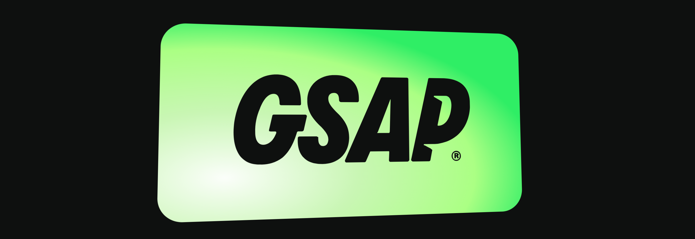
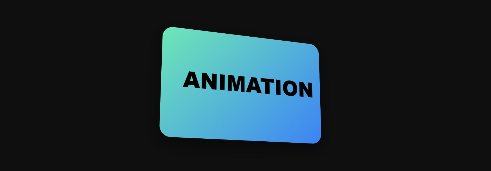
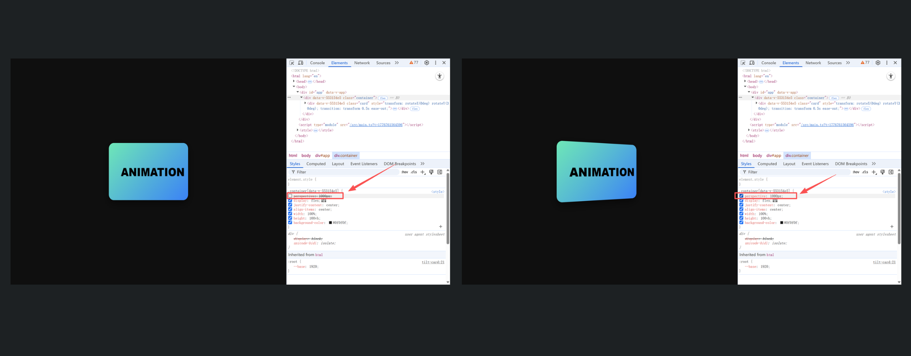
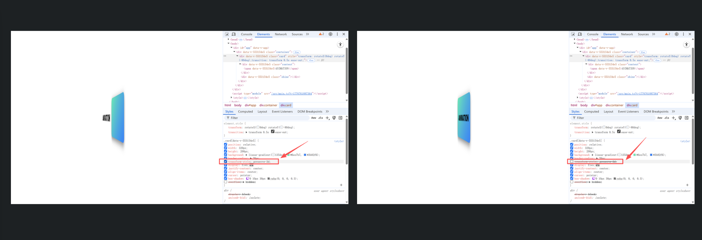

# 鼠标跟随倾斜动效卡片

## 前言：

最近在 gsap 上看到一个有趣的动效（[Cursor-driven perspective tilt](https://demos.gsap.com/demo/cursor-driven-perspective-tilt/)），于是决定自己实现一下，下面将介绍实现的过程，希望你能喜欢。



## 观察动效

1. 卡片的倾斜角度会随着鼠标的移入在 x 轴和 y 轴上向内进行倾斜。
2. 卡片上的文字是悬浮在卡片，给人一种悬空在空中的错觉。

## 技术拆解

要实现这种 3D 的效果，在 css 中你首先想到的是什么？

在 CSS 中有三个属性实现 3D 效果至关重要。它们分别是 perspective、transform-style: preserve-3d、transform: rotateX() rotateY()。下面将详细的介绍他们在 3D 动效中的作用。

1. ** perspective (透视/视距)** ：它是 3D 的灵魂，如果没有它，你看到的效果看起来只像是在平面上进行拉伸和缩放。你可以理解它是3维空间中的z轴，定义观察者距离 z = 0平面的距离。通常设定在父容器上，数值越小（如500px），透视畸变越强烈（近大远小极度明显）；数值越大（如 2000px），效果越平缓。
2. **transform-style: preserve-3d** ：它的作用是告诉子元素（文字层）也要保持在 3D 空间中，这样我们看到的容器的内容是有深度的，同时也可以在侧面看到元素与元素之间的距离。当父元素设置了transform-style: preserve-3d 的时候，同时子元素需要设置 transform: translateZ()。
3. **transform: rotateX() rotateY()**：这个属性相信大家都知道，这也是这次动效能实现的关键。rotateX 控制卡片绕水平轴转动，rotateY 控制卡片绕垂直轴转动。

总结一下

如果把 CSS 3D 比作一场电影：

- perspective 是**摄影机**，决定了画面的纵深感。
- transform-style: preserve-3d 是**舞台搭建**，决定了演员（元素）能不能在台前幕后来回走动，而不是画在背景板上。
- transform: rotate / translate 是**演员的动作**，决定了物体怎么摆放和移动。

## 效果展示 

如果你已经理解了上面属性，相信实现效果只是时间的问题，下面我就提前剧透一下效果吧！同时在浏览器中为你演示各个的属性的具体效果，让你更加深刻的理解上面的属性。



上面是一个正常的效果，试想一下，如果没有设置 perspective 属性会怎么样呢？为了更好的演示，我会将卡片绕着它的y轴固定旋转30度。然后对比设置了 perspective 属性和没有设置 perspective 的效果如下，可供参考。


在对比了设置 perspective 的作用后，接下来为你演示  transform-style: preserve-3d 的效果，为了更好的演示，接下来调整一下卡片在y轴的旋转角度为-80度，同时对子元素设置 transform: translateZ(50px); 将背景调整为白色，让文字和背景不会重合。对比效果如下：


从上面的效果可以看出，设置了 transform-style: preserve-3d 的文字和背景卡片是分离的，没有设置 transform-style: preserve-3d 的文字被拍扁在卡片上面。

注意事项: 当容器设置了 transform-style: preserve-3d; 的时候，不能再设置 overflow: hidden; 不然 transform-style: preserve-3d; 不会生效。

经过上面的对比可以帮助我们更好的理解每个属性在具体场景中的使用，下面就使用 vue3 去实现具体的功能。

## 代码拆解

代码如下：

```vue
<template>
  <div class="container">
    <div 
      class="card"
      ref="cardRef"
      :style="cardStyle"
      @mousemove="handleMouseMove"
      @mouseleave="handleMouseLeave"
    >
      <div class="content">
        <span>ANIMATION</span>
      </div>
    </div>
  </div>
</template>

<script setup>
import { ref, reactive, computed } from 'vue';

const cardRef = ref(null);

// 存储旋转角度
const transform = reactive({
  rotateX: 0,
  rotateY: 0
});

// 计算最终的 CSS 样式
const cardStyle = computed(() => {
  const scale = 1;
  return {
    transform: `rotateX(${transform.rotateX}deg) rotateY(${transform.rotateY}deg)`,
    transition: 'transform 0.5s ease-out'
  };
});

const handleMouseMove = (e) => {
  if (!cardRef.value) return;

  const rect = cardRef.value.getBoundingClientRect();
  const centerX = rect.left + rect.width / 2;
  const centerY = rect.top + rect.height / 2;
  
  // 计算鼠标距离中心点的偏移量 (-1 到 1)
  const percentX = (e.clientX - centerX) / (rect.width / 2);
  const percentY = (e.clientY - centerY) / (rect.height / 2);

  const deg = 25; // 最大旋转角度
  transform.rotateY = percentX * deg;
  transform.rotateX = -percentY * deg; // 取反是因为鼠标向上移动时图片应向下倾斜
};

const handleMouseLeave = () => {
  transform.rotateX = 0;
  transform.rotateY = 0;
};
</script>

<style scoped>
.container {
  /* 3D 透视的关键 */
  perspective: 1000px; 
  display: flex;
  justify-content: center;
  align-items: center;
  width: 100%;
  height: 100vh;
  background-color: #0f0f0f;
}

.card {
  position: relative;
  width: 320px;
  height: 200px;
  background: linear-gradient(135deg, #6ee7b7, #3b82f6);
  border-radius: 20px;
  transform-style: preserve-3d;
  display: flex;
  justify-content: center;
  align-items: center;
  cursor: pointer;
  box-shadow: 0 10px 30px rgba(0, 0, 0, 0.5);
  /* overflow: hidden; */
}

.content {
  font-family: 'Arial Black', sans-serif;
  font-size: 2.5rem;
  color: #000;
  /* 让文字在 3D 空间悬浮 */
  transform: translateZ(50px); 
  pointer-events: none;
}
</style>
```

简要分析:

1. 绑定事件：鼠标移入卡片触发 mousemove 事件，设置卡片旋转。鼠标移除触发 mouseleave 事件将旋转的角度置为0。
2. 样式动态计算：动态绑定 style，通过计算属性实时更新旋转的角度。
3. 计算偏移量： 这里主要利用鼠标当前的位置减去卡片中心点计算出偏移距离，然后再除以卡片宽高的一半，等到一个-1到1的偏移值。
4. 角度映射：通过得到的偏移值乘以 deg (25度)，刚好可以映射到对应的角度，比如鼠标移动到最左边，卡片正好偏转 -25度。


## 优化补充

下面是一些优化的建议，有兴趣的同学可以自己实现一下：

1. 增加光影变化，跟随鼠标移动的卡片增加渐变层的光影，让整体更加真实。
2. mousemove在移动端不支持，增加移动端的支持。


